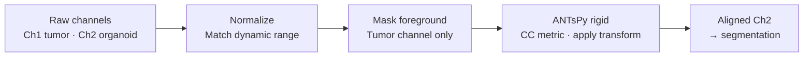
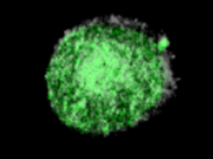

# Channel Registration

> **Pipeline context:** Stage 4 — Data Issue Correction. Runs before two-channel segmentation.

Spatial misalignment was observed between the tumor and organoid fluorescence channels. The source is not definitively established but is consistent with physical drift between sequential acquisitions. Registration brings both channels into the same coordinate space before the segmentation model sees the data.

---

## Pipeline

---

## Design Choices

| Decision | Choice | Rationale |
|---|---|---|
| **Transform type** | Rigid only | Misalignment is physical drift between acquisitions, not tissue deformation. A deformable transform would absorb real biological signal as warp artifacts. |
| **Similarity metric** | Cross-correlation (CC) | Both channels image the same structures — the brightest object in one channel is the brightest in the other. CC exploits this preserved intensity ranking. Mutual information makes no such assumption and is less appropriate here. |
| **Foreground masking** | Restrict metric to tumor-channel foreground | Background-to-background matching carries no structural information and introduces noise into the optimization. A percentile-threshold mask limits metric computation to meaningful signal, improving convergence and reducing runtime. |
| **Pre-registration normalization** | Match dynamic range across channels | The two channels have different dynamic ranges. CC requires comparable intensity scales — range mismatch causes the optimizer to exhaust all iterations without converging. Discovered through debugging. |

---

## Validation

Alignment quality was assessed by visual inspection of channel overlays before and after registration.

**Before registration** — misaligned channel overlay:

**After registration** — aligned channels:

